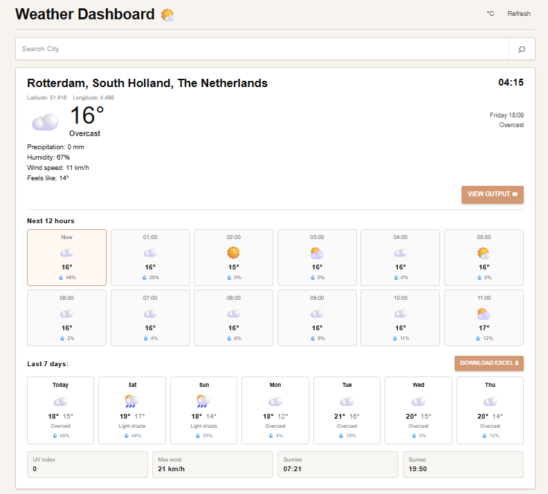

# Weather App

A simple weather dashboard built with React, TypeScript, and Flask.
It uses the free Open-Meteo API to show current weather, hourly weather, and a 7-day forecast.

## Screenshot



## Features

- Search cities worldwide
- Current weather
- 7-day forecast
- Hourly forecast
- Celsius / Fahrenheit
- Rain probability
- Humidity and wind speed
- UV index
- Sunrise and sunset
- CSV forecast export
- No API key required

## How to Run

### Backend

```bash
python3 -m venv venv
source venv/bin/activate
pip install -r requirements.txt
python app.py
```

Open:

```text
http://127.0.0.1:5000
```

### Frontend Development

If you want to edit the React frontend:

```bash
cd client
npm install
npm start
```

For a production build:

```bash
npm run build
```

The production files are placed in `client/build`.

## Project Structure

```text
weather-app-main/
├── app.py
├── requirements.txt
├── server/
├── client/
├── docs/
│   └── weather-app.png
└── README.md
```

## API

Weather data is provided by Open-Meteo.

https://open-meteo.com/
